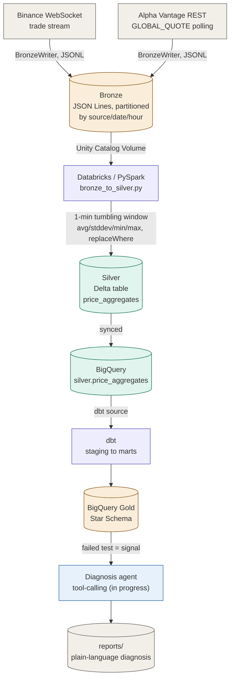
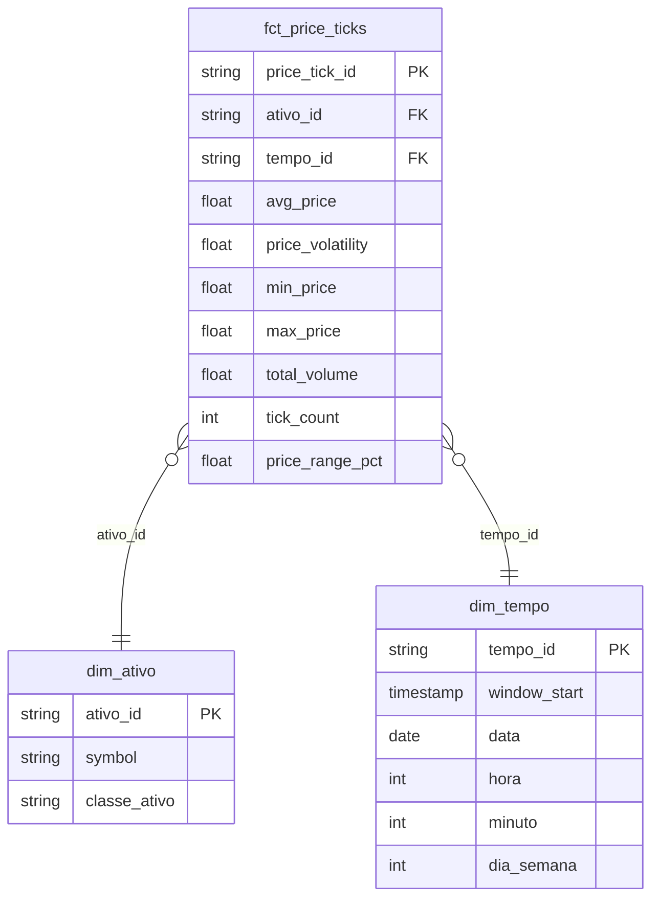

# Market Pulse — Real-Time Market Data Observability

An analytics engineering project on live market data: crypto trades (Binance WebSocket)
and equity quotes (Alpha Vantage REST) are streamed into a **Bronze → Silver → Gold**
lakehouse — ingestion in Python, batch processing on **Databricks (PySpark/Delta)**,
warehouse modeling on **BigQuery + dbt** — with data-quality tests wired up to feed a
diagnosis agent, not just to fail a build.

Unlike a classic batch pipeline over a static CSV, here the data never stops arriving.
That single fact changes the design everywhere: ingestion has to be a long-running,
self-healing process instead of a scheduled job; the batch layer has to be idempotent
per source instead of append-only; and a "failing" data-quality test can mean a real
market event instead of a bug. Quality and observability aren't an afterthought here —
they're the actual point of the project.

> **Note on scope:** the ingestion, Databricks and dbt layers are functional and have
> processed real trade/quote data end to end (see the star schema below). The diagnosis
> agent and its Airflow scheduling are scaffolded but not implemented yet — see
> [Roadmap](#roadmap).

## Architecture



Ingestion and the batch layer are decoupled on purpose: `ingestion/` runs forever as two
independent processes (one per source), while `databricks/bronze_to_silver.py` runs
on demand and simply re-reads whatever landed in Bronze since the last run — neither
side needs to know about the other's schedule.

## Star schema



**Grain**: one row per (asset, 1-minute window) — the same grain the Databricks
aggregation already produces, so the surrogate key in staging (`symbol` +
`window_start`) is just made explicit again in the fact table rather than re-derived.
`price_range_pct` (the intra-window high/low spread) is computed once in
`fct_price_ticks` instead of being recalculated by every downstream consumer, since it's
also what the anomaly test below reads.

## Tech stack

| Layer | Tool |
|---|---|
| Streaming ingestion | Python, `websockets` (Binance combined trade stream) |
| Polling ingestion | Python, `requests` (Alpha Vantage REST) |
| Bronze storage | JSON Lines, partitioned by `source/date/hour` |
| Batch processing | Databricks, PySpark, Delta Lake, Unity Catalog |
| Warehouse | Google BigQuery |
| Transformation | dbt, `dbt_utils` |
| Data quality | dbt generic tests + 1 custom singular test (price-jump anomaly) |
| Orchestration (planned) | Apache Airflow |
| Diagnosis agent (planned) | Python, tool-calling over BigQuery |
| Containerization | Docker / docker-compose (ingestion services) |
| CI | GitHub Actions (pytest + `dbt parse`) |

## Repository structure

```
market-data-observability/
├── .github/workflows/
│   └── ci.yml                       # pytest + dbt parse on every push/PR
├── agent/                           # Diagnosis agent (scaffolded, see Roadmap)
│   ├── agent.py                          # Entry point: diagnose_failures()
│   ├── tools.py                          # BigQuery tool-calling functions
│   ├── notify.py                         # Webhook report delivery
│   └── config.py
├── dags/
│   └── pipeline_orchestration_dag.py     # Airflow: dbt build -> agent -> notify (skeleton)
├── data/bronze/                     # Raw JSONL landing zone (not versioned)
├── databricks/
│   ├── bronze_to_silver.py               # PySpark batch job: Bronze -> Silver (Delta)
│   └── notebooks/                        # Ad-hoc exploration notebooks
├── dbt/
│   ├── models/
│   │   ├── staging/                      # 1:1 cleanup + surrogate key
│   │   │   └── sources.yml                    # Silver source definition
│   │   └── marts/                        # Star schema: 1 fact + 2 dimensions
│   ├── tests/                            # Custom singular test (price-jump anomaly)
│   ├── dbt_project.yml
│   └── profiles.yml.example
├── ingestion/
│   ├── binance_stream_listener.py        # WebSocket -> Bronze, auto-reconnect + backoff
│   ├── alphavantage_poller.py            # REST polling -> Bronze, rate-limit aware
│   ├── common/
│   │   ├── config.py
│   │   └── writer.py                     # BronzeWriter: partitioned JSONL + dedupe
│   └── Dockerfile
├── tests/                           # pytest: ingestion parsing + writer (mocked, no network)
├── docker-compose.yml
├── requirements.txt
├── requirements-dev.txt
└── .env.example
```

## Pipeline stages

### 1. Ingestion (Python, continuous)
Two independent long-running processes, not scheduled jobs — the whole premise of this
project is that market data never stops arriving:

- `binance_stream_listener.py` subscribes to Binance's combined WebSocket stream
  (`<symbol>@trade`) for the configured symbols. No API key needed — trade data is
  public. Reconnects automatically with exponential backoff (capped at 60s) on
  connection loss.
- `alphavantage_poller.py` polls the REST `GLOBAL_QUOTE` endpoint for stock symbols.
  Alpha Vantage's free tier caps at 5 requests/minute and 25/day, so the delay between
  requests is computed from the number of configured symbols rather than hardcoded —
  add a symbol and the poller automatically slows down to stay under the limit.

Both write through the same `BronzeWriter`: JSON Lines partitioned by
`source/date/hour`, with best-effort in-process deduplication (e.g. a WebSocket
reconnect re-sending the last trade). That dedup is per-process, not persisted —
downstream still treats Bronze as "at-least-once" data, which is why the next stage is
built to be idempotent rather than relying on the write path to guarantee uniqueness.

### 2. Bronze → Silver (Databricks, PySpark)
`databricks/bronze_to_silver.py` reads the raw JSON Lines from a Unity Catalog Volume,
aggregates into 1-minute tumbling windows (avg/stddev/min/max price, volume, tick count)
and writes a Delta table.

Deliberately **batch, not streaming**: each run re-reads the whole Bronze Volume for the
selected source and overwrites just that source's rows in Silver (`replaceWhere`).
Re-running after more files land recomputes everything for that source — no checkpoint,
no duplicate rows, no structured-streaming state to manage. At this data volume that's
simpler and just as correct as a streaming job; it's the kind of trade-off that would
need revisiting if a full re-read per run ever got too expensive.

Binance (trade-by-trade) and Alpha Vantage (quote snapshot via polling) have different
payload shapes *and* different meanings for "volume": Binance's `quantity` is summed per
window, while Alpha Vantage's `volume` is the exchange's running daily total — so the
**max** seen in the window is used instead of a sum, otherwise the number would be wildly
overcounted. Both sources are normalized into the same output schema so they can land in
a single `fct_price_ticks` downstream.

### 3. Silver → Gold (BigQuery + dbt)
The Silver Delta table is synced to BigQuery (`silver.price_aggregates`), where
`dbt/models/` builds a small star schema:

- `stg_price_ticks` — 1:1 staging model, generates a surrogate key from
  `(symbol, window_start)`
- `dim_ativo` — one row per symbol, classifies crypto (`%USDT`) vs. equities
- `dim_tempo` — one row per time window, with date/hour/minute/day-of-week already
  extracted so marts never need to re-derive calendar fields
- `fct_price_ticks` — one row per (asset, time window), joined to both dimensions

### 4. Data quality as a signal, not just a gate
Standard dbt generic tests (`unique`, `not_null`, `relationships`) guard the keys and
foreign keys across the star schema. One custom singular test,
`assert_price_jump_within_bounds`, flags any window where an asset moved more than 10%
— deliberately treated as a **business signal**, not a broken pipeline. A "failing" test
here is exactly the kind of event the diagnosis agent is meant to investigate next, not
something to silence.

### 5. Diagnosis agent & orchestration (in progress)
`agent/` is scaffolded but not wired up end to end yet: `tools.py` already has a working
BigQuery query (`query_price_window`) to pull an asset's price history around a failure
window; `agent.py` is where a tool-calling loop will read failed-test results, correlate
them with volatility, and write a plain-language diagnosis to `reports/`.
`dags/pipeline_orchestration_dag.py` sketches the Airflow wiring
(`dbt build` → agent → notify) that will run this on a schedule once the agent has
something real to call.

## Testing & CI

- **`tests/` (pytest)** — unit tests for the ingestion layer: Binance trade-event
  parsing and stream URL construction, Alpha Vantage quote parsing (including the
  throttling and missing-quote responses, with `requests.get` mocked — no network
  calls, no API key needed), and `BronzeWriter`'s partitioning + deduplication logic.
  Run locally:
  ```bash
  pip install -r requirements.txt -r requirements-dev.txt
  pytest tests/ -v
  ```
- **`.github/workflows/ci.yml`** — runs on every push/PR to `main`: the pytest suite
  above, plus `dbt deps && dbt parse` against a dummy BigQuery profile (`oauth` stub —
  no real GCP credentials touch this repo or its CI) to catch broken `ref()`/`source()`
  calls or invalid YAML/Jinja before merge. It does not run `dbt build` in CI, since
  that needs a real warehouse connection — wiring GCP service-account secrets into a
  portfolio repo's CI is a line deliberately left uncrossed here.
- dbt's own test suite (`dbt test`, or as part of `dbt build`) runs against the real
  warehouse — see [Roadmap](#roadmap) for scheduling it automatically.

## Setup

**Prerequisites**: Python 3.12+, a Databricks workspace with Unity Catalog, a GCP
project with BigQuery enabled.

### Ingestion (runs locally or in Docker)
```bash
cp .env.example .env
# fill in ALPHA_VANTAGE_API_KEY (free at alphavantage.co)

pip install -r requirements.txt
python -m ingestion.binance_stream_listener
python -m ingestion.alphavantage_poller
```
Or both at once:
```bash
docker compose up
```
Raw events land in `data/bronze/<source>/<date>/<hour>.jsonl`.

### Bronze → Silver (Databricks)
Upload `databricks/bronze_to_silver.py` as a notebook, point the `catalog` /
`bronze_schema` / `silver_schema` widgets at your Unity Catalog setup, and run it once
per source (`binance`, `alphavantage`) after Bronze has data.

### Silver → Gold (dbt)
```bash
cd dbt
cp profiles.yml.example ~/.dbt/profiles.yml   # fill in your GCP project + keyfile
dbt deps
dbt build
```

## Roadmap

- [x] Continuous ingestion (Binance WebSocket + Alpha Vantage polling) writing to Bronze
- [x] Databricks/PySpark batch job: Bronze → Silver (Delta, Unity Catalog)
- [x] Silver → BigQuery sync and Gold star schema modeling with dbt
- [x] Data quality tests, including the price-jump anomaly signal
- [x] Unit tests + CI (pytest + `dbt parse` on every push/PR)
- [ ] Automate the Silver → BigQuery sync (currently a manual step)
- [ ] Diagnosis agent: tool-calling loop that reads failed dbt tests and investigates
      via `query_price_window`
- [ ] Automatic diagnosis report generation (`reports/`)
- [ ] Airflow scheduling for `dbt build` → agent → notify

## License

[MIT](LICENSE)
